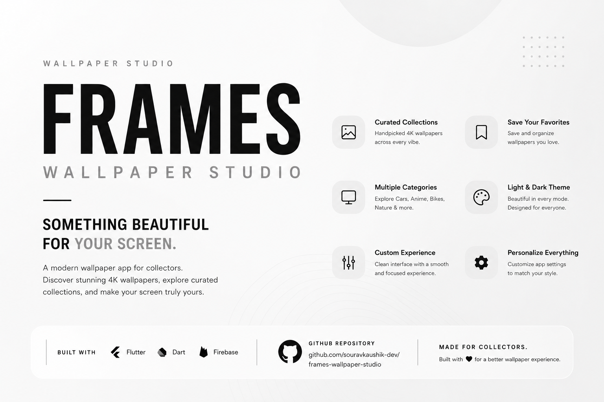
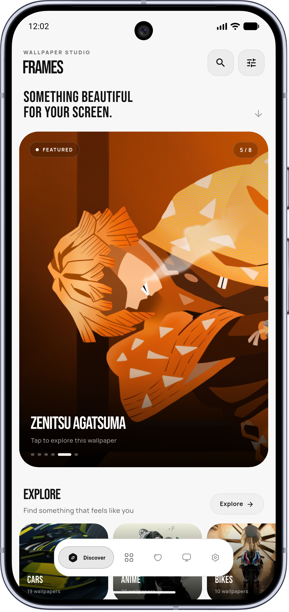
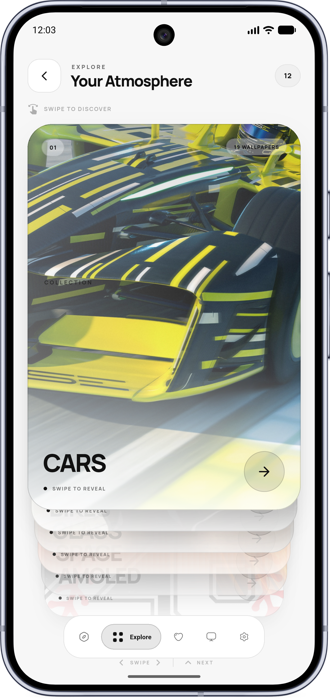
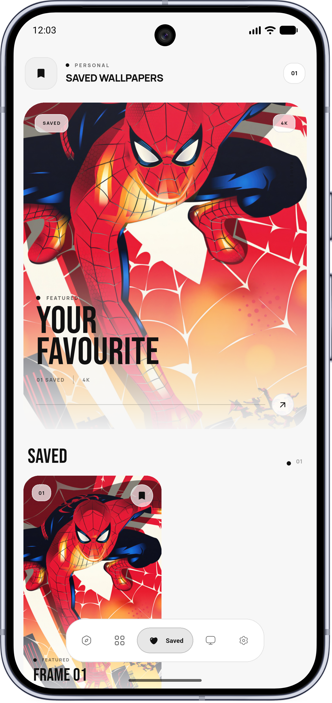
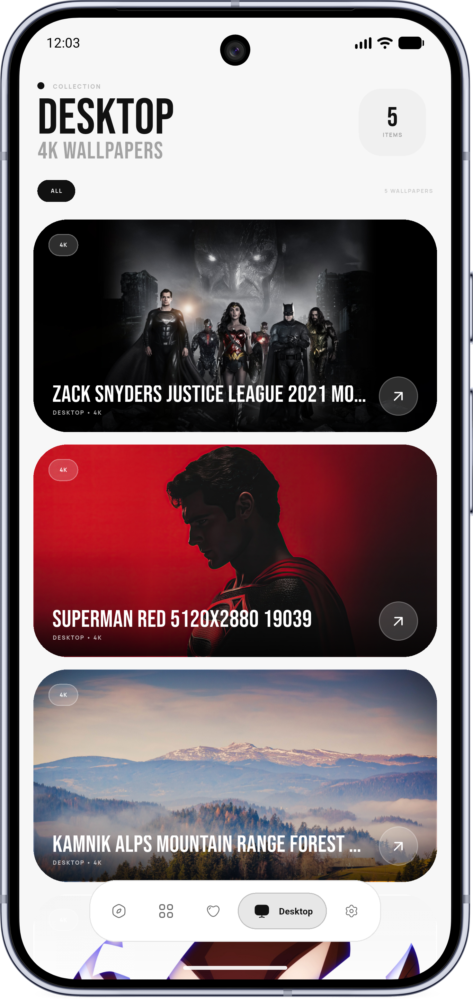
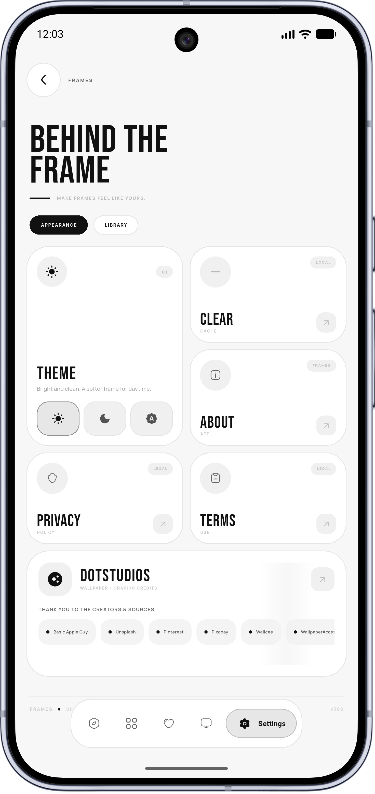

<p align="center">
  
</p>

<br>

<h1 align="center">Frames — Wallpaper Studio</h1>

<p align="center">
  <strong>Where Every Wallpaper Becomes a Frame.</strong>
</p>

<p align="center">
  Discover. Experience. Personalize.
</p>

<p align="center">
  A modern and cinematic wallpaper experience built with Flutter,
  designed to make discovering, saving, downloading, and setting wallpapers
  feel smooth, beautiful, and effortless.
</p>

<p align="center">
  
  
  
  
  
  
</p>

---

# 🎞️ Frames — Wallpaper Studio

**Frames — Wallpaper Studio** is a modern wallpaper application built with **Flutter**, designed around a cinematic and immersive approach to wallpaper discovery.

Instead of feeling like a traditional image gallery, Frames focuses on creating a complete visual experience.

Discover a wallpaper.

Explore its details.

Preview it beautifully.

Save it to Favorites.

Download it to your device.

Set it as your wallpaper.

**Everything comes together inside Frames.**

---

# 🌌 The Idea Behind Frames

A wallpaper is more than just an image.

It changes the atmosphere of your device, influences how your home screen feels, and becomes part of your everyday digital environment.

Frames was created with that idea in mind.

The application puts the wallpaper at the center of the experience while keeping navigation, discovery, and personalization simple.

The design combines:

* 🎬 Cinematic presentation
* ✨ Smooth animations
* 🖼️ Large visual previews
* 🔍 Easy discovery
* ❤️ Personal collections
* ⬇️ Direct downloads
* 📱 Direct wallpaper setting
* 🌗 Dark & Light themes

The result is a wallpaper experience that feels modern, immersive, and personal.

---

# 🚀 Version 3.0

**Frames v3.0** is a major evolution of the application.

This version introduces a more polished visual identity, smoother interactions, and a more complete wallpaper workflow.

The focus of v3.0 is simple:

> **Make wallpaper discovery feel like an experience.**

## ✨ v3.0 Highlights

* 🎬 Cinematic and modern interface
* 🌀 Smooth animations and transitions
* 🖼️ Dynamic wallpaper content
* 🌐 NPoint API integration
* 🔍 Smart wallpaper search
* 📂 Category-based discovery
* ❤️ Fully working Favorites
* ⬇️ Fully working Downloads
* 📱 Fully working Set Wallpaper
* 🕒 Recently viewed wallpapers
* 🌗 Dark & Light themes
* ⚡ Responsive Flutter performance
* 🎨 Refined visual experience

---

# 🎥 The Frames Experience

Frames follows a simple journey from discovery to personalization.

```text
             DISCOVER
                 │
                 ▼
              EXPLORE
                 │
                 ▼
              PREVIEW
                 │
        ┌────────┴────────┐
        │                 │
        ▼                 ▼
    FAVORITE          DOWNLOAD
        │                 │
        └────────┬────────┘
                 │
                 ▼
          SET WALLPAPER
                 │
                 ▼
             YOUR FRAME
```

The goal is to make every step feel natural.

No unnecessary complexity.

No complicated workflow.

Just **find → experience → personalize**.

---

# ✨ Features

## 🎬 Cinematic User Interface

Frames is built around a cinematic visual experience.

The interface uses modern layouts, immersive wallpaper presentation, smooth transitions, and subtle animations to create a premium feeling throughout the application.

The wallpaper remains the visual focus while the interface stays clean and functional.

---

## 🖼️ Wallpaper Discovery

Explore a dynamic collection of wallpapers powered by the **NPoint API**.

Content can be loaded dynamically, allowing the application to present wallpaper data without relying entirely on static content bundled inside the app.

The discovery experience is designed for both intentional searching and casual browsing.

---

## 🔍 Smart Search

Looking for something specific?

Use the built-in search functionality to quickly discover wallpapers based on your query.

The search flow is designed to reduce the distance between:

```text
Search
  ↓
Discover
  ↓
Preview
  ↓
Personalize
```

---

## 📂 Categories

Browse wallpapers through organized categories.

Categories make it easier to explore different styles and discover wallpapers without having to search for everything manually.

Whether you're looking for a particular aesthetic or simply exploring, categories provide another way to navigate the wallpaper collection.

---

## ❤️ Favorites

Found a wallpaper you love?

Save it.

Frames includes a fully working **Favorites** feature that allows users to build their own personal wallpaper collection.

Favorites make it easy to return to wallpapers you previously discovered without having to search for them again.

```text
Discover Wallpaper
        ↓
     ❤️ Favorite
        ↓
  Personal Collection
```

---

## ⬇️ Download Wallpapers

Frames includes fully working wallpaper downloads.

When you find something you want to keep, you can download the wallpaper directly to your device.

The process is designed to stay inside the Frames experience:

```text
Preview
   ↓
Download
   ↓
Saved to Device
```

No complicated workflow is required.

---

## 📱 Set Wallpaper

One of the core features of Frames is the ability to set a wallpaper directly from the application.

Once you find the right wallpaper, you can apply it to your device without manually navigating through your device's wallpaper settings.

```text
Discover
   ↓
Preview
   ↓
Set Wallpaper
   ↓
Done
```

This makes Frames more than a wallpaper discovery application — it becomes a complete wallpaper personalization tool.

---

## 🕒 Recently Viewed

Frames keeps track of recently viewed wallpapers so you can easily return to content you've already explored.

This is especially useful when browsing a large collection and wanting to compare or revisit wallpapers later.

---

## 🌗 Dark & Light Themes

Frames supports both **Dark Mode** and **Light Mode**.

The theme system allows users to choose the visual environment they prefer while maintaining the application's cinematic identity.

---

## 🌀 Smooth Animations

Motion is an important part of the Frames experience.

Animations and transitions help connect different parts of the application and make navigation feel fluid.

The goal isn't to animate everything unnecessarily.

Instead, motion is used where it helps make the interface feel more natural and polished.

---

# 🌐 NPoint API

Frames uses the **NPoint API** as its source for wallpaper-related data.

NPoint provides the structured data consumed by the application, allowing Frames to dynamically retrieve and display wallpaper content.

The application communicates with the configured NPoint endpoint and processes the returned data for presentation inside the Flutter UI.

### Data Flow

```text
             NPoint API
                  │
                  ▼
          API Response/Data
                  │
                  ▼
             Services
                  │
                  ▼
              Providers
                  │
                  ▼
            Flutter UI
                  │
                  ▼
          Wallpaper Experience
```

This structure keeps the data layer separated from the UI and makes the application easier to maintain and extend.

---

# 🛠️ Technology Stack

## 💙 Flutter

Frames is built using Flutter for the application interface and cross-platform development foundation.

Flutter allows the project to create a highly customized interface with smooth animations and responsive layouts.

## 🎯 Dart

Dart is used throughout the application for business logic, models, services, state management, and Flutter UI development.

## 🔄 Provider

**Provider** is used for state management.

It helps separate application state from individual UI components and keeps data-driven screens easier to manage.

## 🌐 NPoint API

NPoint is used to provide the wallpaper data consumed by Frames.

The API-based architecture allows the application to retrieve content dynamically.

## 💾 Shared Preferences

Shared Preferences is used for lightweight local data persistence.

It supports locally stored application information and user-related preferences where required.

## 🔐 Flutter Dotenv

Flutter Dotenv is used for environment-based configuration.

This helps keep configurable values outside the main application source code.

---

# 🏗️ Project Architecture

Frames follows a modular Flutter project structure.

```text
lib/
│
├── models/
│   └── Application data models
│
├── providers/
│   └── State management
│
├── screens/
│   └── Application screens
│
├── services/
│   └── API and application services
│
├── widgets/
│   └── Reusable UI components
│
├── utils/
│   └── Utilities and helpers
│
└── main.dart
```

The separation of models, providers, services, screens, and reusable widgets helps keep the application organized as new functionality is introduced.

---

# 🔄 Data & Application Flow

A simplified view of the application's data flow:

```text
              ┌───────────────┐
              │   NPoint API  │
              └───────┬───────┘
                      │
                      ▼
              ┌───────────────┐
              │    Service    │
              └───────┬───────┘
                      │
                      ▼
              ┌───────────────┐
              │    Provider   │
              └───────┬───────┘
                      │
                      ▼
              ┌───────────────┐
              │   Flutter UI  │
              └───────┬───────┘
                      │
             ┌────────┼────────┐
             │        │        │
             ▼        ▼        ▼
         Favorite  Download  Wallpaper
                              Setting
```

This approach keeps network/data responsibilities separate from presentation logic.

---

# 📱 App Screenshots

<p align="center">
  
  
  
</p>

<p align="center">
  
  
</p>

---

# 🎨 Design Philosophy

Frames is built around three fundamental ideas.

## 01 — Discover

Make finding beautiful wallpapers effortless.

Search, categories, and dynamic content give users multiple ways to discover something new.

## 02 — Experience

Let the wallpaper take center stage.

The interface uses cinematic presentation and motion to make browsing feel immersive.

## 03 — Personalize

Finding a wallpaper is only the beginning.

Frames lets users:

* ❤️ Save it
* ⬇️ Download it
* 📱 Set it
* 🕒 Revisit it

The final result is a wallpaper that becomes part of the user's own device experience.

---

# 🔥 Feature Status

| Feature                | Status          |
| ---------------------- | --------------- |
| Wallpaper Discovery    | ✅ Complete      |
| NPoint API Integration | ✅ Complete      |
| Wallpaper Search       | ✅ Complete      |
| Categories             | ✅ Complete      |
| Wallpaper Preview      | ✅ Complete      |
| Favorites              | ✅ Fully Working |
| Downloads              | ✅ Fully Working |
| Set Wallpaper          | ✅ Fully Working |
| Recently Viewed        | ✅ Complete      |
| Dark Theme             | ✅ Complete      |
| Light Theme            | ✅ Complete      |
| Cinematic UI           | ✅ Complete      |
| Animations             | ✅ Complete      |
| Version 3.0 Redesign   | ✅ Complete      |

---

# 🚀 Getting Started

Want to run Frames locally?

Follow the steps below.

## 1. Clone the Repository

```bash
git clone https://github.com/souravkaushik-dev/dotty.git
cd dotty
```

> If the repository has been renamed to `frames-wallpaper-studio`, replace the repository URL and directory name accordingly.

---

## 2. Install Dependencies

Run:

```bash
flutter pub get
```

This installs all required Flutter packages.

---

## 3. Configure Environment Variables

Create a `.env` file in the root directory.

```env
API_KEY=YOUR_API_KEY
```

Add your required API configuration values according to the project's environment setup.

### 🔐 Keep credentials private

Never commit private API keys or credentials to GitHub.

Add the environment file to `.gitignore`:

```gitignore
.env
```

---

## 4. Check Flutter

Verify your Flutter environment:

```bash
flutter doctor
```

Resolve any required Android or Flutter configuration issues before running the application.

---

## 5. Run Frames

Connect an Android device or launch an emulator:

```bash
flutter run
```

The application should build and launch on your selected Android device.

---

# ⚙️ Requirements

To run Frames locally, you should have:

* Flutter SDK
* Dart SDK
* Android Studio or another Flutter-compatible IDE
* Android SDK
* Android emulator or physical Android device
* Internet connection
* Required NPoint/API configuration

---

# 📂 Recommended Project Assets

The README uses one cinematic poster and five application screenshots.

```text
assets/
│
├── frames-poster.png
│
├── screenshot1.png
├── screenshot2.png
├── screenshot3.png
├── screenshot4.png
└── screenshot5.png
```

The poster acts as the visual hero of the project, while the five screenshots showcase the actual application experience.

---

# 🗺️ Roadmap

Frames v3.0 establishes the foundation for a larger wallpaper experience.

## ✅ Completed

* [x] Cinematic interface
* [x] Modern visual redesign
* [x] Smooth animations
* [x] NPoint API integration
* [x] Wallpaper discovery
* [x] Search
* [x] Categories
* [x] Wallpaper preview
* [x] Favorites
* [x] Downloads
* [x] Set Wallpaper
* [x] Recently viewed wallpapers
* [x] Dark Mode
* [x] Light Mode
* [x] Version 3.0 release

## 🔮 Future Ideas

* [ ] More wallpaper collections
* [ ] More personalization options
* [ ] Curated wallpaper collections
* [ ] Improved caching
* [ ] Enhanced offline experience
* [ ] More advanced animations
* [ ] Additional customization tools
* [ ] Expanded platform support

---

# 🤝 Contributing

Frames — Wallpaper Studio is currently maintained primarily as a personal and portfolio project.

If you discover a bug, have a feature suggestion, or want to discuss an improvement, feel free to open an issue in the repository.

For larger changes, discussing the idea before implementation is recommended.

---

# ⭐ Support the Project

If you like **Frames — Wallpaper Studio**, you can support the project by:

* ⭐ Starring the repository
* 🐛 Reporting bugs
* 💡 Suggesting features
* 📢 Sharing the project
* 👨‍💻 Exploring the source code

Your support helps the project continue to evolve.

---

# 👨‍💻 Developer

## Sourav Kaushik

**Flutter Developer & Builder**

I'm passionate about building modern mobile experiences that combine **design, animation, functionality, and usability**.

Frames — Wallpaper Studio is a project focused on creating a more immersive way to discover and personalize wallpapers while exploring modern Flutter development.

<p align="center">
  <a href="https://github.com/souravkaushik-dev">
    
  </a>
</p>

---

# 📄 License

**All Rights Reserved.**

Frames — Wallpaper Studio is provided for portfolio and demonstration purposes only.

No permission is granted to copy, modify, redistribute, reuse, publish, or commercially exploit any part of this project without explicit written permission from the author.

Permission for any reuse must be obtained directly from the author.

---

<br>

<p align="center">
  <strong>Frames — Wallpaper Studio</strong>
</p>

<p align="center">
  <em>Where Every Wallpaper Becomes a Frame.</em>
</p>

<p align="center">
  Discover • Experience • Personalize
</p>

<p align="center">
  Made with ❤️ & Flutter
</p>
